# 本地速送服务平台 — 系统流程图

> 以下流程图覆盖平台核心业务流程与系统整体架构，采用 Mermaid 语法，可在支持 Mermaid 的编辑器中直接渲染。

---

## 一、系统整体架构图

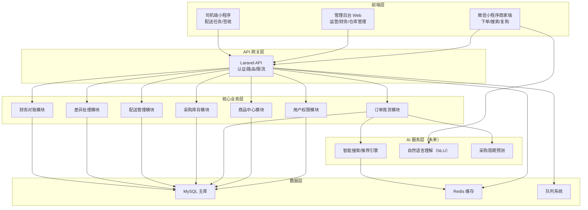

---

## 二、平台统采流程

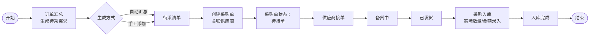

---

## 三、客户直采流程（商家下单）

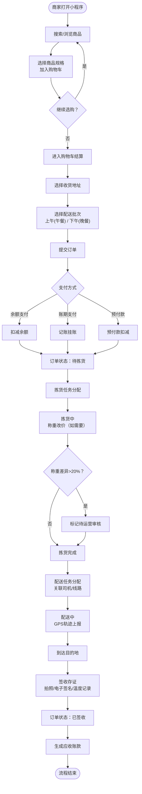

---

## 四、智能下单流程（小程序商家端）

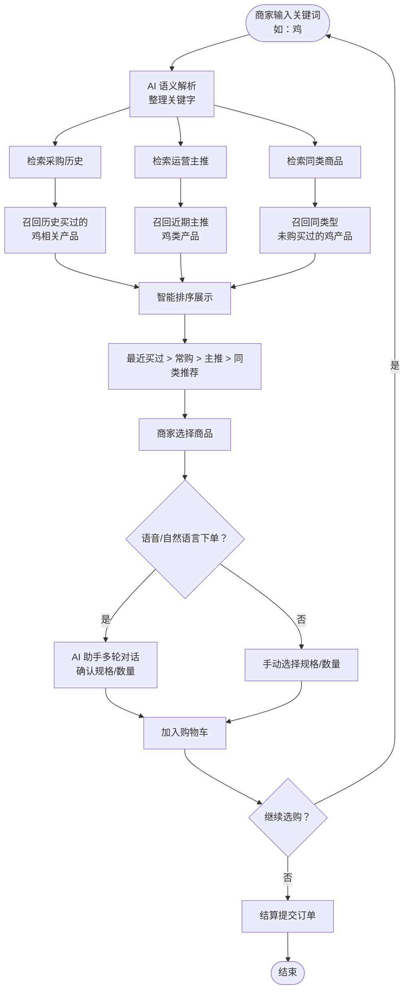

---

## 五、差异处理流程

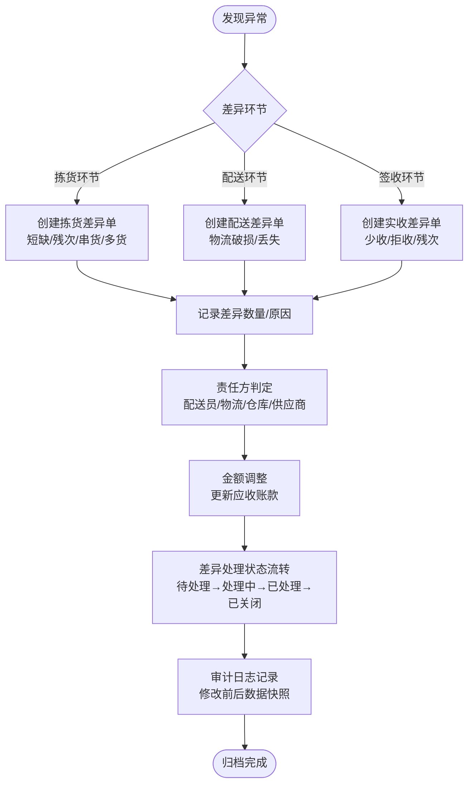

---

## 六、财务结算流程

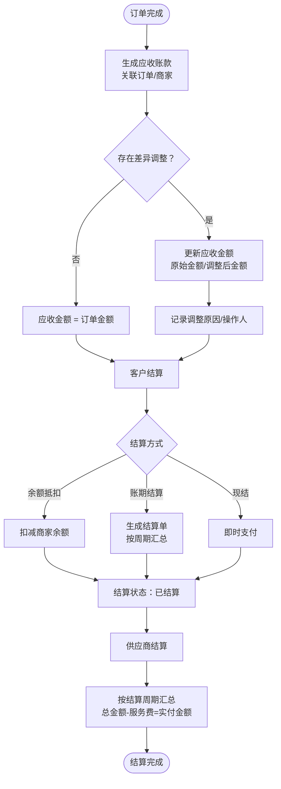

---

## 七、订单状态全生命周期

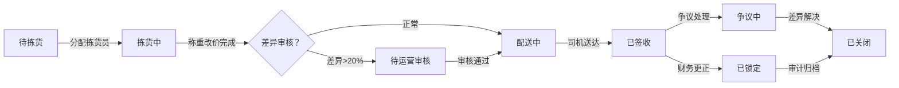

---

## 八、采购入库与库存联动

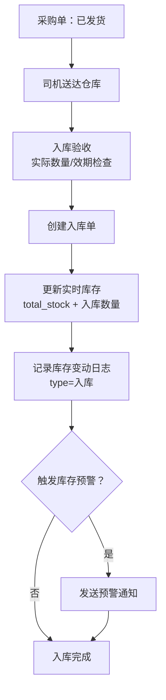

---

## 九、配送任务生成与执行

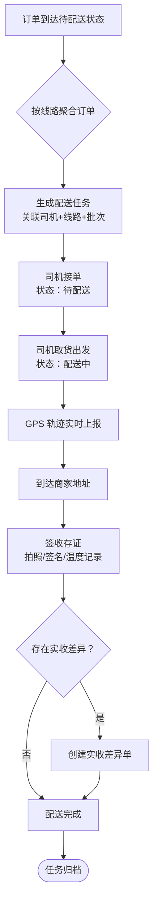

---

## 十、数据隔离与权限控制

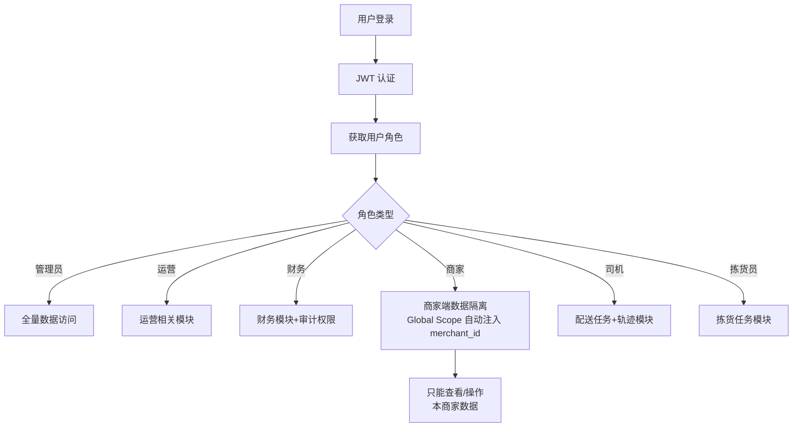

---

## 十一、AI 服务层交互（未来扩展）

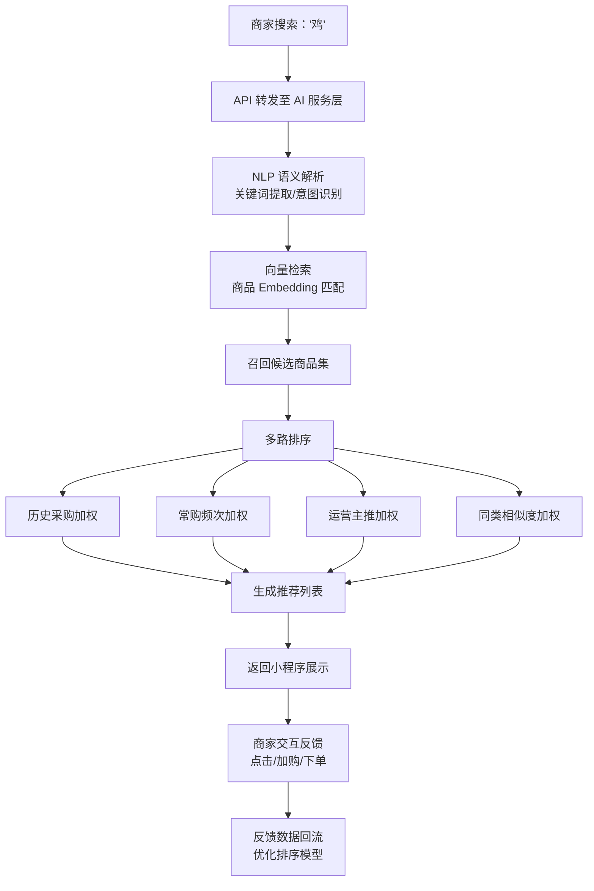

---

> **说明**：以上流程图覆盖了平台从商家下单到配送完成、从采购入库到财务结算的完整业务链路，以及 AI 智能服务的未来扩展方向。实际开发中可根据模块优先级分阶段实现。
