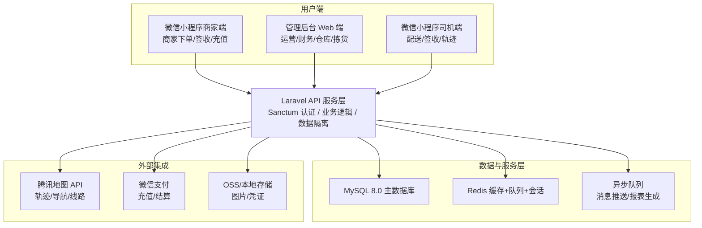
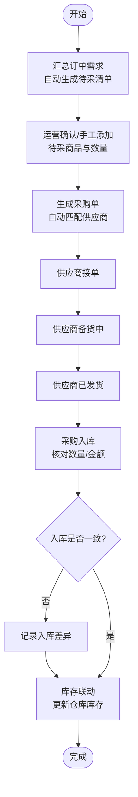
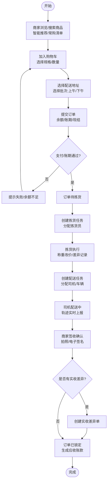
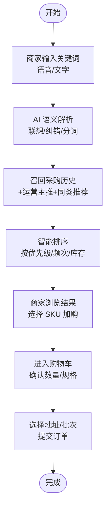
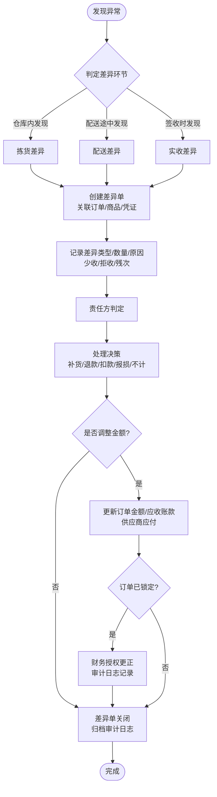
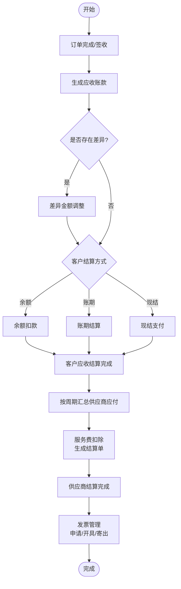

# PRD 业务需求说明书

项目名称：本地速送服务平台（含生鲜配送）
版本：V1.0
编制日期：2026-07-24
编制人：开发负责人

---

## 1 项目概述

### 1.1 项目背景

本项目为本地生鲜/农产品配送平台，面向 B 端商家（酒店、餐厅）提供食材采购与配送服务。平台核心特点：

- **冷链与非冷链区分**：部分食材需冷链运输，部分常温配送
- **一日两配**：支持上午（午餐批次）和下午（晚餐批次）两次配送
- **称重改价**：生鲜商品按实际称重调整结算金额
- **订单分散**：全天不同时段订货，无明显峰值
- **公司规模小**：人少、并发低，需快速开发演示

### 1.2 建设目标

- 实现商家在线采购、平台统一采购、仓储管理、配送调度全流程数字化
- 支持称重改价、差异处理、财务对账等生鲜行业特有业务
- 管理后台支持运营/财务/拣货/配送等多角色协作
- 微信小程序商家端支持智能搜索、快速复购、补货提醒
- 微信小程序司机端支持配送任务、轨迹上报、拍照签收
- 数据统一存储、操作留痕、审计可追溯
- 预留 AI 智能助手扩展接口（未来迭代）

---

## 2 角色与权限定义

| 角色名称 | 权限范围 | 使用人员 |
| :--- | :--- | :--- |
| 超级管理员 | 全部功能、系统配置、账号管理 | 运维/创始人 |
| 运营管理员 | 商品管理、订单管理、商家管理、供应商管理、运营主推配置 | 业务主管 |
| 财务人员 | 应收账款、供应商结算、发票管理、单据授权更正、审计日志 | 财务专员 |
| 拣货员 | 拣货任务查看/执行、称重改价、拣货差异记录 | 仓库拣货人员 |
| 配送司机 | 配送任务查看/执行、轨迹上报、拍照签收 | 配送司机 |
| 商家 | 商品浏览/搜索/下单、订单查看、收货确认、充值 | 酒店/餐厅采购人员 |

---

## 3 核心业务流程

### 3.1 平台统采流程

待采清单 → 生成采购单 → 供应商接单 → 备货中 → 已发货 → 采购入库 → 完成

### 3.2 客户直采流程（商家下单）

商家搜索/浏览商品 → 加入购物车 → 选择地址/批次 → 提交订单 → 支付 → 待拣货 → 拣货中（称重改价）→ 配送中 → 已签收 → 生成应收账款

### 3.3 智能下单流程（小程序商家端）

输入关键词 → AI 语义解析/联想 → 召回采购历史 + 运营主推 + 同类推荐 → 智能排序展示 → 商家选择加购 → 提交订单

### 3.4 差异处理流程

发现异常 → 判定差异环节（拣货/配送/实收） → 创建差异单 → 记录差异类型/数量/原因/凭证 → 责任方判定 → 处理决策（补货/退款/扣款/报损/不计） → 金额调整 → 更新应收账款/订单金额 → 审计日志归档

统一规则：
- 一个差异单只对应一个环节（拣货、配送、实收），由发现方在对应环节创建。
- 同一订单同一商品在同一环节下，只能存在一个未关闭的差异单；不同环节可按时间顺序依次产生。
- 差异触发优先级：仓库内发现 → 拣货差异；配送途中发现 → 配送差异；商家签收时或签收后规定时效内 → 实收差异。
- 差异处理中若涉及订单金额或应收调整，且订单已签收锁定，需经财务授权更正后方可修改，修改后重新锁定并归档审计日志。
- 差异处理结果同步影响：订单明细金额、商家应收账款、供应商应付结算（如责任方为供应商），争议中差异可暂缓结算。
- 所有差异单的创建、修改、金额调整、关闭均进入审计日志。

### 3.5 财务结算流程

订单完成 → 生成应收账款 → 差异调整（如有）→ 客户结算（余额/账期/现结）→ 供应商结算（按周期汇总）

---

## 4 系统模块范围

### 4.1 管理后台 Web 端（React + Laravel API）

1. **用户与权限管理模块** — 用户、角色、权限、RBAC
2. **组织主体管理模块** — 供应商、商家、配送线路、司机、车辆
3. **商品管理模块** — 分类、商品、SKU 规格、可见性白名单、关键词标签
4. **平台统采模块** — 待采清单、采购单、采购入库
5. **客户直采模块** — 购物车、订单管理、订单明细、常购清单、一键复购
6. **库存管理模块** — 仓库、实时库存、库存变动日志、库存预警
7. **拣货管理模块** — 拣货任务、拣货执行
8. **物流配送模块** — 配送任务、收货地址、配送轨迹、签收存证
9. **差异处理模块** — 统一差异单管理、拣货差异处理、配送差异处理、实收差异处理、差异金额调整与审批、差异报表
10. **财务对账模块** — 客户账户、充值、供应商结算、应收账款、发票、单据授权更正
11. **系统支撑模块** — 系统配置、轮播广告、运营主推配置、操作日志、审计日志、队列与缓存

### 4.2 微信小程序商家端（原生开发）

1. 微信用户绑定 / 登录
2. 商品智能搜索下单（关键词联想 + 采购历史关联）
3. 购物车管理
4. 订单创建与查看
5. 收货确认
6. 充值
7. 常购清单 / 收藏商品
8. 智能补货提醒

### 4.3 微信小程序司机端（原生开发）

1. 配送任务接收
2. 导航 / 轨迹上报
3. 拍照签收 / 电子签名
4. 冷链温度记录

---

## 5 技术栈

### 5.1 后端

| 技术 | 版本 | 说明 | 使用场景（匹配功能） |
| :--- | :--- | :--- | :--- |
| Laravel | 13.x | 主框架 | API 路由、业务逻辑、数据校验、定时任务 |
| PHP | 8.3 | 运行环境 | 匹配 Laravel 13 要求 |
| MySQL | 8.0 | 主数据库 | 订单、库存、结算等事务数据；JSON 字段存扩展属性 |
| Redis | 7.x | 缓存 + 队列 + 会话 | ① 缓存：商品列表、系统配置、字典数据 ② 队列：订单通知、报表导出、批量任务 ③ 会话/Token：管理后台登录态 ④ 分布式锁：库存扣减防超卖 ⑤ 限流：API 频率限制 |
| Laravel Sanctum | 最新 | API Token 认证 | 商家端小程序、管理后台 SPA 登录认证 |
| Spatie Permission | 最新 | RBAC 角色权限 | 菜单/按钮级权限，角色动态渲染侧边栏 |
| Laravel Queue | 内置 | 异步任务 | 短信/消息通知、Excel 导出、对账任务 |
| Laravel Reverb | 可选 | 实时推送（WebSocket） | 订单状态变更、配送轨迹实时推送 |

### 5.2 管理后台 Web 端

| 技术 | 说明 | 使用场景（匹配功能） |
| :--- | :--- | :--- |
| React | 18.x | 管理后台单页应用（SPA） |
| TypeScript | 类型安全 | 与后端 API 数据结构对齐，减少联调错误 |
| Vite | 构建工具 | 开发热更新、生产打包 |
| Tailwind CSS | 原子化样式 | 全局样式基座，承载主题 token |
| shadcn/ui | UI 组件库 | 表单、弹窗、下拉等全部基础组件；基于 CSS 变量 + 主题 token 定制（详见 5.4） |
| TanStack Table | 复杂表格 | 订单、库存、财务、拣货等所有列表页（虚拟滚动、筛选、排序） |
| TanStack Query | 数据获取与缓存 | 列表/详情数据请求、乐观更新、后台同步 |
| Zustand | 轻量状态管理 | 全局用户态、购物车（如有 Web 端）、跨页面共享状态 |
| React Router v6 | 页面路由 | 管理后台页面级路由、懒加载 |
| Recharts / ECharts | 图表统计 | 财务报表、销售趋势、配送统计图表 |
| 腾讯地图 JS API | 配送轨迹、线路规划 | 配送调度地图、司机轨迹回放 |

### 5.3 微信小程序

| 端 | 技术 | 使用场景（匹配功能） |
| :--- | :--- | :--- |
| 商家端 | Taro 4 + React + TypeScript | 智能搜索下单、购物车、订单查看、签收确认、充值；与管理后台复用类型/API 层 |
| 司机端 | 原生微信小程序 | 配送任务接收、导航、轨迹上报、拍照签收、冷链温度记录 |

### 5.4 前端主题规范（shadcn/ui）

管理后台基于 shadcn/ui 的 **CSS 变量 + 主题 token** 机制统一定制主题，整体风格为**小圆角、小字体、小按钮**；全局反馈与通知统一使用 Sonner + 右侧 Drawer：

1. **主题机制**：shadcn/ui 组件全部读取 CSS 变量（`--background`、`--primary`、`--radius` 等），Tailwind 通过 token 映射（如 `borderRadius.lg = var(--radius)`）消费这些变量，改一处变量全局生效
2. **基础颜色可配置**：在 CSS 变量层直接修改 HSL 色值即可切换主题基色（主色、辅色、成功/警告/错误/信息语义色），支持 `:root` 与 `.dark` 双主题；项目默认使用蓝、橙、黄、绿、红配色，避免页面单调
3. **圆角尺度可配置**：通过 `--radius` 单变量控制全局圆角基准，Tailwind  token 派生 `rounded-lg/md/sm`，卡片、按钮、输入框、弹窗、Drawer 统一小圆角
4. **小圆角**：`--radius: 0.25rem`（4px）
5. **小字体**：默认 M 档——正文/按钮 14px，辅助/表格/badge 13px，区块标题 16px，页面标题 19px，统计数字 22px，信息密度优先（S/L 档完整数值见 Setup 6.5.2）
6. **小按钮**：默认 M 档——按钮高 32px、列表操作按钮高 26px、字号 14px（S 档 30/24px，L 档 36/30px），与表格/表单的紧凑布局匹配
7. **轻提醒（Toast）**：统一使用 Sonner 组件，代替浏览器 alert 或原生 toast，保持样式与动效一致
8. **通知中心**：站内消息/系统通知统一采用右侧滑出的 Drawer 面板展示，入口位于顶部导航栏，宽度默认 360px，小圆角
9. **尺寸档位可配置**：字体与图标支持 S / M / L 三档（**系统默认 M 档**：正文 14px、图标 16px、按钮 32px）；在 `.env` 配置 `VITE_UI_SIZE=S|M|L` 即可一键同步修改系统所有字体、图标与按钮尺寸，实现上通过 `<html data-size>` 切换 CSS 尺寸变量全站生效；开发**优先组件化**，按钮/图标/Block/Badge/Alert/表格封装为全局组件（AppButton、AppIcon、StatBlock、StatusBadge、AppAlert、AppTable）复用，组件尺寸引用 token、禁止写死 px；完整颜色与尺寸数值见《05 Setup 安装部署配置手册》第 6.5、6.6 节（规范自包含，不依赖任何示例文件）
10. 具体配置代码见《05 Setup 安装部署配置手册》第 6 节「管理后台主题配置」

---

## 6 非功能性需求

### 6.1 性能

- 管理后台页面首屏加载 ≤ 2 秒
- API 接口响应时间 ≤ 500ms（P95）
- 支持 100 人同时在线管理后台
- 小程序页面切换流畅，无明显卡顿

### 6.2 兼容性

- 管理后台：Chrome / Edge / Safari 最新两个大版本
- 小程序：微信基础库 2.30.0+

### 6.3 安全性

- 密码 bcrypt 加密存储
- API 请求 Sanctum Token 认证
- 敏感操作（删除、结算、授权更正）二次确认
- 操作日志不可删除，审计日志完整记录修改前后数据
- 商家数据隔离（按 merchant_id 自动过滤）

### 6.4 可维护性

- RESTful API 设计规范
- 数据库迁移文件可复现
- 配置参数化（system_configs 表）
- 支持快速迭代，预留 AI 扩展接口

---

## 7 交付验收标准

1. 全部需求功能可正常操作，无阻断性 BUG
2. 管理后台 + 小程序商家端 + 小程序司机端三端联调通过
3. 核心业务流程跑通：商家下单 → 拣货 → 配送 → 签收 → 结算
4. 部署文档完整，可全新服务器一键安装
5. 数据字典、接口文档齐全
6. 提供基础初始化数据脚本（角色、管理员账号、系统配置）

## 8 系统流程图

> 以下流程图采用 Mermaid 语法，可在 GitHub、GitLab、Typora 等支持 Mermaid 的 Markdown 环境中直接渲染。对应的可编辑 `.drawio` 源文件位于 `docs/flowcharts/` 目录，可用 [draw.io / diagrams.net](https://app.diagrams.net) 打开修改。

### 8.1 整体系统业务架构图

### 8.2 平台统采流程

### 8.3 客户直采流程

### 8.4 智能下单流程

### 8.5 差异处理流程

### 8.6 财务结算流程

### 8.7 流程图源文件清单

| 文件名 | 对应内容 | 适用场景 |
| :--- | :--- | :--- |
| `docs/flowcharts/01_整体系统业务架构图.drawio` | 三端 + API + 数据层 + 外部集成 | 技术架构评审、部署说明 |
| `docs/flowcharts/02_平台统采流程.drawio` | 待采清单 → 采购入库 | 供应商/采购模块开发 |
| `docs/flowcharts/03_客户直采流程.drawio` | 商家下单 → 签收 → 应收账款 | 订单/配送/财务核心流程 |
| `docs/flowcharts/04_智能下单流程.drawio` | 小程序 AI 搜索推荐加购 | 商家端智能下单模块 |
| `docs/flowcharts/05_差异处理流程.drawio` | 差异判定 → 处理 → 归档 | 差异处理/财务审计模块 |
| `docs/flowcharts/06_财务结算流程.drawio` | 应收/供应商结算/发票 | 财务对账模块 |

