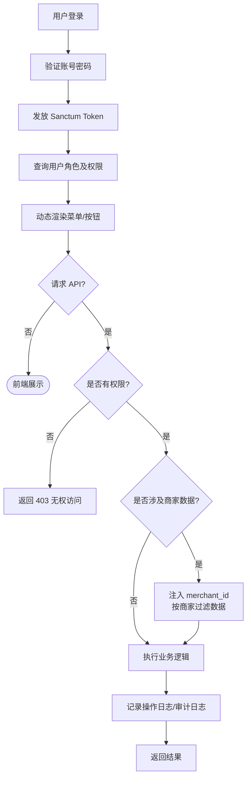
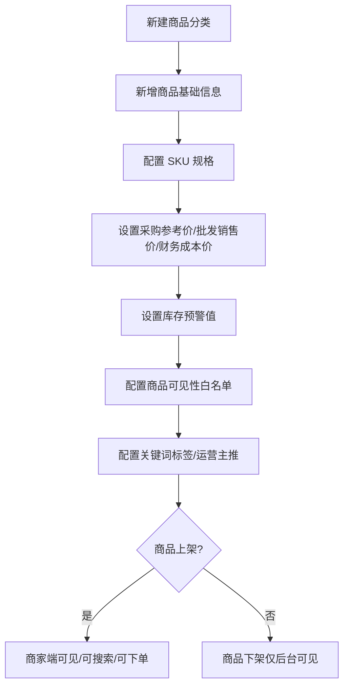
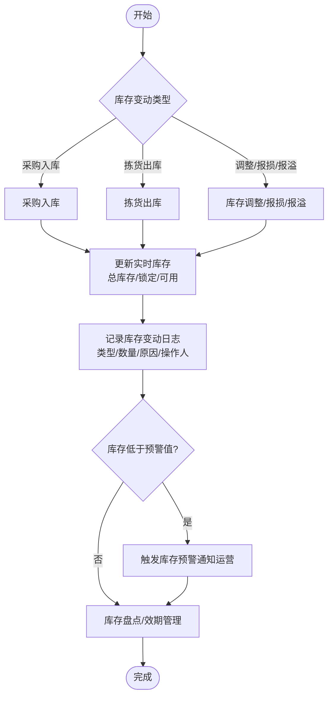
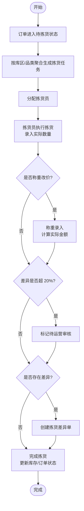
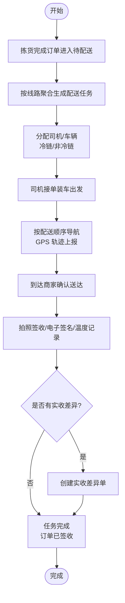
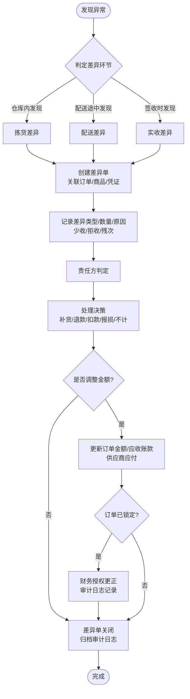
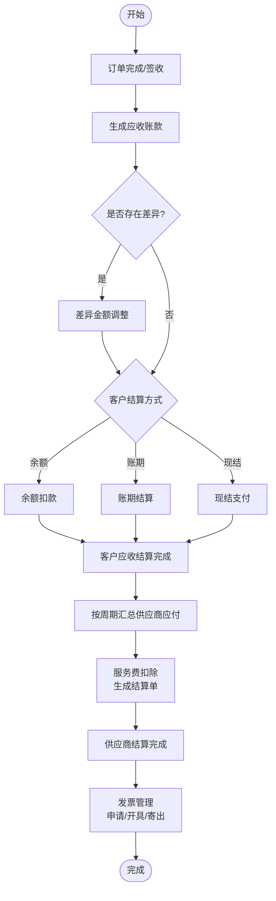
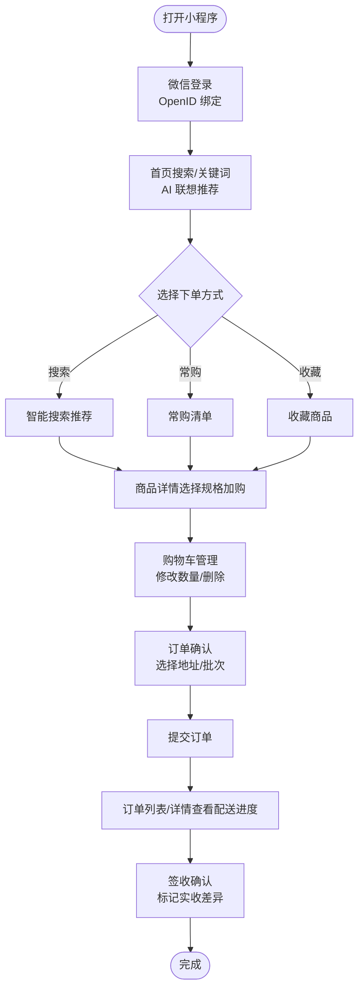
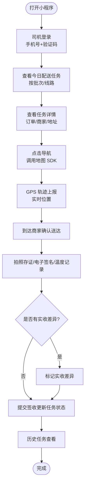

# FSD 功能详细说明书

对应 PRD 版本：V1.0
技术栈：Laravel 13 (API) + React 18 + TypeScript + MySQL 8.0 + Redis 7.x

*FSD*（Functional Specifications Document），中文名为*功能详细说明*，是定义产品功能需求全部细节的设计文档。该文档通过产品界面截屏和功能点描述明确产品规格，是工程师可直接用于创建产品的技术文件。

---

## 1 公共通用功能（全局）

### 1.1 登录页

1. 账号（用户名/手机号/邮箱）+ 密码登录
2. 图形验证码防暴力破解
3. 记住登录状态 7 天（Token 自动续期）
4. 登录失败提示：账号不存在 / 密码错误 / 账号禁用
5. 登录成功跳转首页；登录错误记录日志
6. 密码重置：发送验证码到绑定手机/邮箱

### 1.2 全局布局（顶部导航 + 侧边菜单 + 内容区）

1. 侧边栏按角色动态渲染菜单（无权限菜单隐藏）
2. 菜单支持展开/折叠，刷新后保持折叠状态
3. 顶部栏：面包屑导航、消息通知入口（点击后唤起右侧 Drawer 通知面板）、全局搜索框
4. 右上角：当前用户头像/名称下拉菜单（个人资料、修改密码、退出登录）
5. 内容区：Tab 页签支持多页面切换（可选）

### 1.3 通用数据表格组件

统一能力：
- 分页（支持页码跳转 + 每页条数选择）
- 多条件筛选（文本搜索、下拉选择、日期范围、状态筛选）
- 列显示/隐藏配置
- 排序（单击表头排序）
- 批量操作（批量删除、批量导出）
- 单条操作（查看详情、编辑、删除）
- 导出 Excel（按需支持批量导入）
- 空数据状态展示
- 加载骨架屏

### 1.4 通用表单组件

- 表单校验：必填项红色提示，阻止提交
- 提交 loading 状态，防重复点击
- 文件上传（图片压缩、预览）
- 日期时间选择器
- 金额输入（保留两位小数）
- 下拉选择（支持搜索、多选）
- 富文本编辑器（商品详情等场景）
- 新增、更新、删除等轻提醒统一使用 Sonner（toast）提示，不使用浏览器 alert；按钮默认小尺寸（`size="sm"`），与紧凑布局匹配。

### 1.5 异常处理统一规范

- 后端接口 500 错误：统一使用 Sonner 提示"系统异常，请稍后重试"
- 401 未授权：自动跳转登录页
- 403 无权限：提示"无权访问"
- 404 接口不存在：记录日志
- 数据删除：二次确认弹窗
- 表单提交失败：聚焦到第一个错误字段

---

## 2 各模块详细功能

### 2.1 用户与权限管理模块

#### 2.1.1 用户管理

| 功能点 | 说明 |
| :--- | :--- |
| 用户列表 | 分页展示，支持按用户名/手机号/角色/状态筛选 |
| 新增用户 | 填写用户名、密码、姓名、手机号、邮箱、角色、状态 |
| 编辑用户 | 修改姓名、手机号、邮箱、角色、状态；用户名不可修改 |
| 重置密码 | 管理员一键重置为初始密码，用户首次登录强制修改 |
| 禁用/启用 | 禁用后无法登录，保留历史数据；可重新启用 |
| 删除用户 | 软删除（保留数据），超级管理员不可删除 |
| 用户详情 | 展示基本信息、角色、创建时间、最后登录时间 |

#### 2.1.2 角色管理

| 功能点 | 说明 |
| :--- | :--- |
| 角色列表 | 展示系统角色 |
| 新增角色 | 填写角色名称、标识、备注 |
| 编辑角色 | 修改角色信息 |
| 删除角色 | 已被用户绑定的角色不可删除 |
| 权限配置 | 为角色勾选权限（树形结构：模块 → 页面 → 按钮） |

#### 2.1.3 权限管理

| 功能点 | 说明 |
| :--- | :--- |
| 权限列表 | 树形展示所有权限节点 |
| 新增权限 | 填写权限名称、标识（route）、类型（菜单/按钮）、上级权限、排序 |
| 编辑权限 | 修改权限信息 |
| 删除权限 | 已被角色引用的权限不可删除 |

#### 2.1.4 数据隔离

- 商家相关数据查询自动注入 `where('merchant_id', ...)`
- 司机只能查看自己的配送任务
- 拣货员只能查看分配给自己的拣货任务

---

### 2.2 组织主体管理模块

#### 2.2.1 供应商管理

| 功能点 | 说明 |
| :--- | :--- |
| 供应商列表 | 分页展示，支持按名称/联系人/状态筛选 |
| 新增供应商 | 名称、联系人、联系电话、地址、银行收付款信息、结算周期（周结/月结） |
| 编辑供应商 | 修改信息 |
| 删除供应商 | 有关联采购单的不可删除 |
| 供应商详情 | 基本信息 + 历史采购单列表 |

#### 2.2.2 商家管理

| 功能点 | 说明 |
| :--- | :--- |
| 商家列表 | 分页展示，支持按名称/线路/结算方式筛选 |
| 新增商家 | 名称、配送地址、所属线路、配送顺序、起送价、结算方式（现结/账期/预付款）、信用额度 |
| 编辑商家 | 修改信息 |
| 删除商家 | 有关联订单的不可删除 |
| 商家详情 | 基本信息 + 历史订单 + 账户余额 + 应收账款 |

#### 2.2.3 配送线路管理

| 功能点 | 说明 |
| :--- | :--- |
| 线路列表 | 展示所有配送线路 |
| 新增线路 | 线路名称、描述 |
| 编辑线路 | 修改信息 |
| 商家排序 | 在线路下调整商家的配送顺序（拖拽排序） |

#### 2.2.4 司机管理

| 功能点 | 说明 |
| :--- | :--- |
| 司机列表 | 分页展示，支持按姓名/手机号/在线状态筛选 |
| 新增司机 | 姓名、手机号、身份证号 |
| 编辑司机 | 修改信息 |
| 在线状态 | 查看司机当前在线/离线状态 |
| 司机详情 | 基本信息 + 绑定车辆 + 历史配送任务 |

#### 2.2.5 车辆管理

| 功能点 | 说明 |
| :--- | :--- |
| 车辆列表 | 展示所有车辆 |
| 新增车辆 | 车牌号、车辆类型、冷链/非冷链 |
| 编辑车辆 | 修改信息 |
| 绑定司机 | 车辆与司机关联/解绑 |

---

### 2.3 商品管理模块

#### 2.3.1 商品分类管理

| 功能点 | 说明 |
| :--- | :--- |
| 分类列表 | 树形展示无限极分类 |
| 新增分类 | 名称、上级分类、图标、排序 |
| 编辑分类 | 修改信息 |
| 删除分类 | 有子分类或有商品的不可删除 |
| 分类状态 | 启用/禁用 |

#### 2.3.2 商品管理

| 功能点 | 说明 |
| :--- | :--- |
| 商品列表 | 分页展示，支持按名称/分类/供应商/状态筛选 |
| 新增商品 | 名称、分类、封面图、单位（斤/箱/份）、是否称重改价、供应商、库存预警值、状态 |
| 编辑商品 | 修改信息 |
| 商品多图 | 上传多张详情图，支持排序 |
| 商品上下架 | 启用/禁用 |
| 商品详情 | 基本信息 + SKU 列表 + 可见性配置 |

#### 2.3.3 SKU 规格管理

| 功能点 | 说明 |
| :--- | :--- |
| SKU 列表 | 在商品详情页展示该商品的所有 SKU |
| 新增 SKU | 规格属性、规格值、采购参考价、批发销售价、财务成本价、库存 |
| 编辑 SKU | 修改信息 |
| 删除 SKU | 有订单关联的不可删除 |

#### 2.3.4 商品可见性配置

| 功能点 | 说明 |
| :--- | :--- |
| 白名单配置 | 按商家勾选可购买的 SKU |
| 批量配置 | 为多个商家批量设置可见商品 |

#### 2.3.5 商品关键词标签

| 功能点 | 说明 |
| :--- | :--- |
| 关键词配置 | 为商品配置搜索关键词、品类标签 |
| 标签管理 | 维护标签词库，支撑智能搜索联想 |

---

### 2.4 平台统采模块

#### 2.4.1 待采清单

| 功能点 | 说明 |
| :--- | :--- |
| 待采列表 | 展示所有待采商品，支持按商品/状态筛选 |
| 自动汇总 | 根据订单商品汇总，自动生成待采需求 |
| 手工添加 | 手动添加待采商品和数量 |
| 生成采购单 | 勾选待采项，生成采购单（自动匹配供应商） |
| 待采状态 | 待生成 / 已生成采购单 |

#### 2.4.2 采购单管理

| 功能点 | 说明 |
| :--- | :--- |
| 采购单列表 | 分页展示，支持按单号/供应商/状态筛选 |
| 采购单详情 | 基本信息 + 商品明细 |
| 状态流转 | 待接单 → 备货中 → 已发货 → 已入库 → 完成 |
| 状态操作 | 供应商接单、确认发货、确认入库 |
| 取消采购单 | 待接单状态下可取消 |

#### 2.4.3 采购入库管理

| 功能点 | 说明 |
| :--- | :--- |
| 入库操作 | 在采购单详情页执行入库 |
| 入库记录 | 实际入库数量、实际金额、操作人、入库时间 |
| 入库差异 | 实际入库与采购数量不一致时，记录差异原因 |
| 库存联动 | 入库后自动更新对应仓库库存 |

---

### 2.5 客户直采模块

#### 2.5.1 购物车（后台查看）

| 功能点 | 说明 |
| :--- | :--- |
| 购物车列表 | 按商家查看购物车内容 |
| 清空购物车 | 管理员可清空某商家的购物车 |

#### 2.5.2 客户订单管理

| 功能点 | 说明 |
| :--- | :--- |
| 订单列表 | 分页展示，支持按单号/商家/状态/批次/日期筛选 |
| 订单详情 | 基本信息 + 商品明细 + 配送信息 + 操作日志 |
| 状态流转 | 待拣货 → 配送中 → 已签收 → 已锁定 → 已关闭 |
| 取消订单 | 待拣货状态下可取消 |
| 订单锁定 | 已签收订单锁定，需财务授权方可编辑 |

#### 2.5.3 订单明细

| 功能点 | 说明 |
| :--- | :--- |
| 商品明细 | SKU、数量、单价、小计 |
| 称重改价 | 录入实际称重数量，自动计算实际结算金额 |
| 称重审核 | 差异超 20% 自动标记"待运营审核" |
| 批次信息 | 上午批次（午餐）/ 下午批次（晚餐） |

#### 2.5.4 常购清单

| 功能点 | 说明 |
| :--- | :--- |
| 常购排行 | 按商家展示采购频次最高的商品 |
| 一键加购 | 运营人员可帮商家一键将常购商品加入购物车 |

#### 2.5.5 订单一键复购

| 功能点 | 说明 |
| :--- | :--- |
| 历史订单复购 | 选择历史订单，整单或部分商品重新生成订单 |
| 快捷模板 | 保存常用商品组合为模板，一键复购 |

---

### 2.6 库存管理模块

#### 2.6.1 仓库管理

| 功能点 | 说明 |
| :--- | :--- |
| 仓库列表 | 展示所有仓库 |
| 新增仓库 | 名称、类型（总仓/前置仓）、冷链/非冷链 |
| 编辑仓库 | 修改信息 |

#### 2.6.2 实时库存

| 功能点 | 说明 |
| :--- | :--- |
| 库存列表 | 按仓库 + SKU 维度展示，支持按仓库/商品筛选 |
| 库存详情 | 当前总库存、锁定库存、可用库存、入库批次号、效期 |
| 库存调整 | 手动调整库存数量（需记录原因） |

#### 2.6.3 库存变动日志

| 功能点 | 说明 |
| :--- | :--- |
| 日志列表 | 展示所有库存变动记录 |
| 变动类型筛选 | 入库 / 出库 / 调拨 / 报损 / 报溢 |
| 日志详情 | SKU、变动数量、变动前/后库存、原因、操作人、时间 |

#### 2.6.4 库存预警

| 功能点 | 说明 |
| :--- | :--- |
| 预警列表 | 展示库存低于预警值的商品 |
| 预警通知 | 系统通知/站内信提醒运营人员 |
| 预警设置 | 按商品设置库存预警阈值 |

---

### 2.7 拣货管理模块

#### 2.7.1 拣货任务

| 功能点 | 说明 |
| :--- | :--- |
| 任务列表 | 分页展示，支持按状态/库区/拣货员筛选 |
| 任务创建 | 按库区/品类聚合订单商品生成拣货单 |
| 任务分配 | 指派拣货员 |
| 拣货执行 | 拣货员按清单拣货，录入实际数量 |
| 状态流转 | 拣货中 → 已完成 |

---

### 2.8 物流配送模块

#### 2.8.1 配送任务管理

| 功能点 | 说明 |
| :--- | :--- |
| 任务列表 | 按日期/线路/司机/状态筛选 |
| 任务创建 | 按线路聚合订单生成配送任务 |
| 任务分配 | 指派司机 |
| 状态流转 | 待配送 → 配送中 → 任务完成 |
| 任务详情 | 关联订单列表、司机信息、配送轨迹 |

#### 2.8.2 配送轨迹

| 功能点 | 说明 |
| :--- | :--- |
| 轨迹地图 | 在地图上展示司机实时位置和轨迹 |
| 轨迹回放 | 查看历史配送轨迹 |
| 轨迹数据 | 经纬度、位置描述、上报时间 |

#### 2.8.3 签收存证

| 功能点 | 说明 |
| :--- | :--- |
| 签收记录 | 查看所有签收凭证 |
| 照片查看 | 签收拍照、质检拍照 |
| 电子签名 | 查看签名图片 |
| 温度记录 | 冷链配送的温度记录 |
| 实收差异 | 标记是否有差异、差异说明（具体处理流程见 2.9 差异处理模块） |

---

### 2.9 实收差异处理模块

| 功能点 | 说明 |
| :--- | :--- |
| 差异单列表 | 按状态/类型筛选 |
| 差异单创建 | 关联配送凭证/订单/商品 |
| 差异记录 | 配送数量 vs 实收数量、差异类型（少收/拒收/残次）、差异金额 |
| 关联应收 | 关联应收账款，标记是否已调整 |
| 差异处理 | 待处理 → 处理中 → 已处理 → 已关闭 |

---

### 2.10 财务对账模块

#### 2.10.1 客户账户管理

| 功能点 | 说明 |
| :--- | :--- |
| 账户列表 | 按商家展示余额、总充值、总消费 |
| 账户详情 | 充值记录 + 消费记录 + 当前余额 |
| 授信额度 | 设置/调整商家的信用额度 |

#### 2.10.2 客户充值

| 功能点 | 说明 |
| :--- | :--- |
| 充值记录 | 展示所有充值记录 |
| 后台充值 | 运营人员可为商家手动充值 |

#### 2.10.3 供应商结算

| 功能点 | 说明 |
| :--- | :--- |
| 结算单列表 | 按供应商/状态/结算周期筛选 |
| 结算单创建 | 按结算周期自动汇总采购单 |
| 金额计算 | 总金额 - 服务费 = 实付金额 |
| 状态流转 | 待结算 → 已结算 |

#### 2.10.4 应收账款管理

| 功能点 | 说明 |
| :--- | :--- |
| 应收列表 | 按商家/状态筛选 |
| 应收详情 | 原始订单金额、调整后金额、差异金额、调整原因、调整人 |
| 结算状态 | 未结算 / 已结算 / 争议中 |

#### 2.10.5 发票管理

| 功能点 | 说明 |
| :--- | :--- |
| 发票列表 | 按类型（客户/供应商）/状态筛选 |
| 发票申请 | 记录发票抬头、金额、状态 |
| 发票上传 | 上传发票文件（PDF/图片） |
| 发票状态 | 待开具 / 已开具 / 已寄出 |

#### 2.10.6 单据授权更正

| 功能点 | 说明 |
| :--- | :--- |
| 锁定管理 | 已签收订单自动锁定，禁止直接编辑 |
| 授权更正 | 财务角色点击"授权更正"，解锁并记录审计日志 |
| 更正记录 | 修改前数据（JSON）、修改后数据（JSON）、更正原因、操作人 |

---

### 2.11 系统支撑模块

#### 2.11.1 系统配置

| 功能点 | 说明 |
| :--- | :--- |
| 配置列表 | 键值对形式的配置项 |
| 新增配置 | 配置键、配置值、备注 |
| 编辑配置 | 修改配置值 |

#### 2.11.2 轮播广告管理

| 功能点 | 说明 |
| :--- | :--- |
| 广告列表 | 展示所有轮播图 |
| 新增广告 | 标题、图片、排序、状态、跳转链接 |
| 编辑/删除 | 修改信息 |

#### 2.11.3 运营主推配置

| 功能点 | 说明 |
| :--- | :--- |
| 主推商品 | 配置近期主推的商品/SKU |
| 主推品类 | 配置近期主推的商品分类 |
| 展示影响 | 影响小程序搜索排序和首页展示 |

#### 2.11.4 操作日志

| 功能点 | 说明 |
| :--- | :--- |
| 日志列表 | 按操作人/时间/模块筛选 |
| 日志内容 | 操作人、请求路径、IP、操作内容 |

#### 2.11.5 审计日志

| 功能点 | 说明 |
| :--- | :--- |
| 审计列表 | 按模型类型/差异类型/时间筛选 |
| 审计详情 | 模型类型、模型 ID、差异类型、操作人、修改前后数据（JSON）、关联订单/配送任务 |

#### 2.11.6 队列与缓存

| 功能点 | 说明 |
| :--- | :--- |
| 队列任务 | 查看队列中的任务、失败任务重试 |
| 缓存管理 | 查看缓存键值、手动清除缓存 |

---

## 3 微信小程序商家端功能

| 模块 | 功能点 | 说明 |
| :--- | :--- | :--- |
| 登录 | 微信登录 | OpenID 绑定系统用户 |
| 首页 | 搜索框 | 输入关键词，AI 联想展示采购历史 + 主推 + 同类推荐 |
| 首页 | 常购清单 | 基于历史采购频次展示 |
| 首页 | 收藏商品 | 快速从收藏夹下单 |
| 商品 | 商品详情 | 查看商品信息、规格选择、加入购物车 |
| 购物车 | 购物车管理 | 修改数量、删除商品、结算 |
| 订单 | 订单创建 | 选择地址、选择配送批次、提交订单 |
| 订单 | 订单列表 | 查看历史订单，支持一键复购 |
| 订单 | 订单详情 | 查看订单状态、商品明细、配送进度 |
| 订单 | 签收确认 | 确认收货，标记实收差异 |
| 我的 | 账户余额 | 查看余额、充值记录 |
| 我的 | 充值 | 选择金额、支付方式充值 |
| 消息 | 订阅消息 | 订单状态变更通知、补货提醒 |

---

## 4 微信小程序司机端功能

| 模块 | 功能点 | 说明 |
| :--- | :--- | :--- |
| 登录 | 手机号+验证码 | 司机账号登录 |
| 任务 | 任务列表 | 查看今日配送任务，按批次展示 |
| 任务 | 任务详情 | 查看订单列表、商家地址、联系方式 |
| 配送 | 导航 | 调用腾讯/高德地图导航 |
| 配送 | 轨迹上报 | GPS 实时位置上报 |
| 配送 | 到达确认 | 标记到达商家地址 |
| 签收 | 拍照存证 | 拍摄签收照片、质检照片 |
| 签收 | 电子签名 | 商家手写签名 |
| 签收 | 温度记录 | 冷链配送录入温度 |
| 签收 | 实收差异 | 标记实收数量差异 |
| 我的 | 历史任务 | 查看历史配送记录 |

---

## 5 权限矩阵

| 功能模块 | 超级管理员 | 运营 | 财务 | 拣货员 | 司机 | 商家 |
| :--- | :--- | :--- | :--- | :--- | :--- | :--- |
| 用户管理 | ✓ | - | - | - | - | - |
| 角色权限 | ✓ | - | - | - | - | - |
| 供应商管理 | ✓ | ✓ | - | - | - | - |
| 商家管理 | ✓ | ✓ | - | - | - | - |
| 商品管理 | ✓ | ✓ | - | - | - | - |
| 采购管理 | ✓ | ✓ | - | - | - | - |
| 订单管理 | ✓ | ✓ | ✓ | - | - | 仅自己的 |
| 拣货任务 | ✓ | ✓ | - | 仅自己的 | - | - |
| 配送任务 | ✓ | ✓ | - | - | 仅自己的 | - |
| 库存管理 | ✓ | ✓ | - | ✓ | - | - |
| 差异处理 | ✓ | ✓ | ✓ | ✓ | - | - |
| 财务对账 | ✓ | - | ✓ | - | - | 仅自己的 |
| 系统配置 | ✓ | - | - | - | - | - |
| 操作日志 | ✓ | - | - | - | - | - |
| 审计日志 | ✓ | - | ✓ | - | - | - |

---

## 6 异常逻辑统一规范

1. 表单必填项未填写：红色提示文字，阻止提交，聚焦第一个错误字段
2. 后端接口 500/401/403/422 错误：统一使用 Sonner 提示，记录日志
3. 数据删除：二次确认弹窗，软删除保留历史数据
4. 提交加载状态：按钮禁用 + loading 动画，防重复点击
5. 无权限访问：隐藏无权限菜单/按钮，越权访问返回 403
6. 数据不存在：404 页面或友好提示
7. 并发冲突：乐观锁或最后写入优先，提示用户数据已变更

---

## 7 技术实现要点

### 7.1 后端

- RESTful API 设计，统一返回格式 `{code, message, data}`
- Laravel Sanctum Token 认证
- 请求参数校验（FormRequest）
- Eloquent 模型关联预加载（with）杜绝 N+1
- 数据库事务包裹关键业务操作
- 操作日志、审计日志自动记录（Observer / Middleware）
- 队列处理异步任务（消息推送、报表生成）

### 7.2 前端

- React Router 页面级路由，BrowserRouter 模式
- TanStack Query 管理服务端状态，自动缓存/刷新
- Zustand 管理客户端全局状态（用户信息、侧边栏状态）
- shadcn/ui 组件统一风格，基于 CSS 变量 + 主题 token 定制：全局小圆角（--radius: 0.25rem）、小字体小按钮（支持 S/M/L 三档尺寸，系统默认 M 档：正文 14px、表格/辅助 13px、按钮 32px，.env `VITE_UI_SIZE` 一键切换全站）；按钮、图标、tag字体、背景、block左边框、图标用蓝、橙、黄、绿、红等配色，页面不要太单调
- 轻提醒统一使用 Sonner（`sonner`）组件，成功/错误/警告/信息四类提示风格与主题色一致
- 消息通知中心统一使用右侧 Drawer（`Sheet`）组件，宽度 360px，小圆角，展示未读/已读通知列表
- 主题 token 支持在 CSS 变量层直接修改基础颜色与圆角尺度，`--radius` 单变量驱动 `rounded-lg/md/sm`，亮/暗主题通过 `:root`/`.dark` 切换，组件代码零改动（主题配置详见 PRD 5.4、Setup 手册第 6 节）
- 组件化开发优先：AppButton / AppIcon / StatBlock / StatusBadge / AppAlert / AppTable 全局封装复用，组件尺寸统一引用 token（`h-[var(--btn-h)]`、`size-[var(--icon)]`），禁止写死 px；业务页面只组装组件、不复制样式（尺寸档位与组件封装详见 Setup 手册 6.5 节）
- 表单使用 react-hook-form + zod 校验
- 表格使用 TanStack Table 虚拟滚动
- 地图集成腾讯地图 JS API
- 图表使用 Recharts          

## 8 模块流程图

> 本章对每个功能模块绘制关键流程图，用于指导开发实现与测试用例设计。流程图使用 Mermaid 语法，可在 Markdown 环境中直接渲染；对应的可编辑 `.drawio` 源文件位于 `docs/flowcharts/` 目录。

### 8.1 用户与权限管理流程（RBAC + 数据隔离）

### 8.2 商品管理流程

### 8.3 库存管理流程

### 8.4 拣货管理流程

### 8.5 物流配送流程

### 8.6 差异处理流程

### 8.7 财务结算流程

### 8.8 微信小程序商家端流程

### 8.9 微信小程序司机端流程

### 8.10 流程图源文件清单

| 文件名 | 对应模块 | 主要用途 |
| :--- | :--- | :--- |
| `docs/flowcharts/01_整体系统业务架构图.drawio` | 全局架构 | 系统架构评审、技术选型说明 |
| `docs/flowcharts/02_平台统采流程.drawio` | 2.4 平台统采模块 | 采购/入库开发 |
| `docs/flowcharts/03_客户直采流程.drawio` | 2.5 客户直采模块 | 订单全生命周期开发 |
| `docs/flowcharts/04_智能下单流程.drawio` | 3 微信小程序商家端 | 智能搜索/推荐下单开发 |
| `docs/flowcharts/05_差异处理流程.drawio` | 2.9 差异处理模块 | 差异单与审计开发 |
| `docs/flowcharts/06_财务结算流程.drawio` | 2.10 财务对账模块 | 应收/供应商结算开发 |
| `docs/flowcharts/07_库存管理流程.drawio` | 2.6 库存管理模块 | 库存/预警/日志开发 |
| `docs/flowcharts/08_拣货管理流程.drawio` | 2.7 拣货管理模块 | 拣货任务/称重改价开发 |
| `docs/flowcharts/09_物流配送流程.drawio` | 2.8 物流配送模块 | 配送任务/签收开发 |
| `docs/flowcharts/10_微信小程序商家端流程.drawio` | 3 微信小程序商家端 | 小程序商家端 UX |
| `docs/flowcharts/11_微信小程序司机端流程.drawio` | 4 微信小程序司机端 | 小程序司机端 UX |
| `docs/flowcharts/12_权限与数据隔离流程.drawio` | 2.1 用户与权限管理模块 | RBAC/数据隔离实现 |

